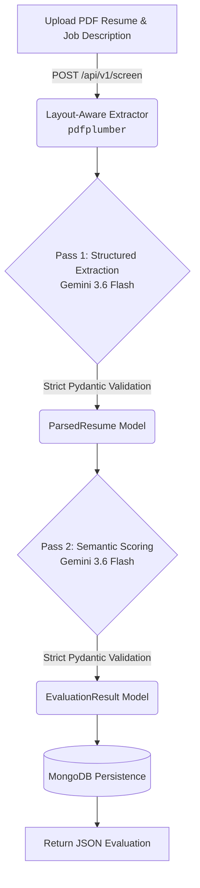

# Smart Resume Screener

The **Smart Resume Screener** is an AI-powered API that automates the tedious process of parsing applicant resumes and scoring them against a target job description. 

By leveraging layout-aware PDF extraction and the reasoning capabilities of Gemini 3.6 Flash, this system completely circumvents the hallucinations and structure loss typical of naïve AI wrappers. It provides structured JSON extraction and semantic candidate evaluation with full MongoDB persistence.

---

## 🏛️ System Architecture

The pipeline consists of a single POST request that orchestrates a multi-step, two-pass LLM workflow, before finally committing the result to a database.



---

## 🧠 LLM Integration Strategy

This project solves the "LLM Hallucination" problem by decoupling extraction from evaluation and strictly enforcing Pydantic schemas via prompt-embedded JSON blueprints and `application/json` enforcement, entirely avoiding the buggy Automatic Function Calling (AFC) implementations in newer SDKs.

### Pass 1: Extraction
**Goal:** Convert raw, messy PDF text into structured data.
**Prompt Strategy:**
> "You are an expert HR parser. Extract the following raw resume text into a JSON object that strictly matches this schema (omit missing optional fields or set them to null)... Return ONLY valid JSON — no markdown, no explanation."

**Schema Enforcement:** The extracted JSON string is immediately passed to `ParsedResume.model_validate_json()`. If Gemini hallucinates a schema mismatch, Pydantic raises an exception, which the router handles gracefully.

### Pass 2: Semantic Evaluation
**Goal:** Score the candidate and explain the reasoning.
**Prompt Strategy:**
> "Compare the following resume with this job description and rate fit on 1-10 with justification. Return a JSON object that strictly matches this schema..."

We pass the `ParsedResume.model_dump_json()` string generated from Pass 1, removing layout noise and ensuring Gemini evaluates the candidate based on concrete, structured attributes rather than raw PDF formatting.

---

## 🔌 API Reference

### 1. Screen Candidate
**`POST /api/v1/screen`**

**Request (multipart/form-data):**
- `file`: The candidate's resume (PDF or TXT).
- `job_description`: The text of the job description.

**Success Response (200 OK):**
```json
{
  "candidate_id": "f47ac10b-58cc-4372-a567-0e02b2c3d479",
  "parsed_resume": {
    "full_name": "Devananditha V",
    "email": "deva@example.com",
    "phone": null,
    "skills": ["Python", "FastAPI", "MongoDB", "NLP"],
    "experience": [...],
    "education": [...],
    "summary": null
  },
  "evaluation": {
    "match_score": 8.5,
    "justification": "The candidate has strong direct experience with Python, FastAPI, and NLP.",
    "matched_skills": ["Python", "FastAPI"],
    "missing_skills": [],
    "recommendation": "Strong Match"
  }
}
```

### 2. List Shortlisted Candidates
**`GET /api/v1/candidates?min_score=7.0`**

**Success Response (200 OK):**
```json
[
  {
    "job_description": "...",
    "parsed_resume": {...},
    "evaluation": {...},
    "created_at": "2026-08-22T02:00:00Z",
    "id": "f47ac10b-58cc-4372-a567-0e02b2c3d479"
  }
]
```

---

## 🚀 Local Setup & Execution

### Prerequisites
- Python 3.11+
- A running local instance of MongoDB (default port `27017`)
- A Google Gemini API Key

### 1. Environment Setup
Create a virtual environment and install dependencies:
```powershell
python -m venv .venv
.\.venv\Scripts\activate
pip install -r requirements.txt
```

### 2. Configuration
Create a `.env` file in the root directory:
```env
GEMINI_API_KEY=your_gemini_api_key_here
MONGODB_URL=mongodb://localhost:27017
DATABASE_NAME=resume_screener
```

### 3. Running the Server
Start the FastAPI server via Uvicorn:
```powershell
uvicorn app.main:app --reload
```
The API is now running at `http://127.0.0.1:8000`. 
Access the auto-generated Swagger UI at `http://127.0.0.1:8000/docs`.

---

## 🧪 Testing

The repository includes a comprehensive 49-test `pytest` suite covering schema validation, layout-aware PDF extraction logic, API failure handling, and route orchestration using mocked services.

To run the test suite:
```powershell
pytest -v
```

---

## 🎬 Demo Walkthrough Script (2-3 Minutes)

Here is a recommended script for recording a video demonstration of this project:

- **Start (0:00 - 0:30):** 
  - Briefly introduce the Smart Resume Screener and its purpose (automating HR screening).
  - Show the terminal, start the server (`uvicorn app.main:app --reload`), and open the Swagger UI (`http://127.0.0.1:8000/docs`).
- **Extraction & Evaluation (0:30 - 1:30):** 
  - Expand the `POST /api/v1/screen` endpoint.
  - Click "Try it out". Upload a complex, multi-column PDF (like the classic Deedy CV).
  - Paste an example job description (e.g., "Looking for a backend dev with FastAPI experience").
  - Execute the request and wait for the response.
- **Reviewing Results (1:30 - 2:00):**
  - Scroll through the JSON response. Point out how cleanly the `ParsedResume` block extracted education and skills, ignoring the complex visual layout of the PDF.
  - Highlight the `EvaluationResult` block. Read the `justification` aloud to prove the LLM didn't just keyword match, but actively reasoned about the candidate's fit. Show the score and recommendation.
- **Database Persistence (2:00 - 2:30):**
  - Expand the `GET /api/v1/candidates` endpoint.
  - Set the `min_score` parameter to `7.0` and execute.
  - Show that the candidate we just evaluated is returned, proving the data was successfully persisted to MongoDB.
