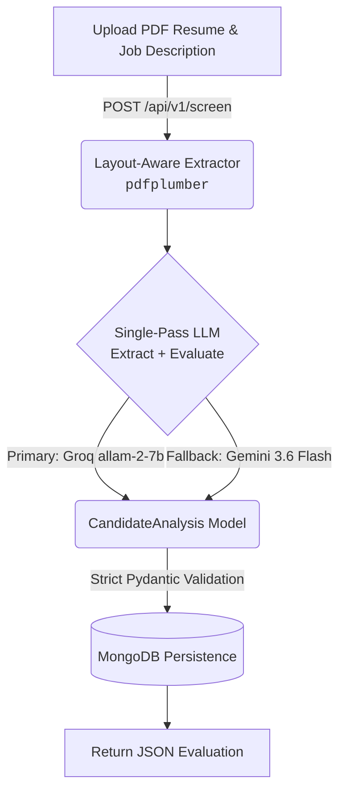

# Smart Resume Screener

> An AI-powered resume screening API that automatically parses candidate resumes and scores them against a job description — eliminating manual screening effort at scale.

[](https://python.org)
[](https://fastapi.tiangolo.com)
[](https://motor.readthedocs.io)
[](LICENSE)

---

## Overview

The Smart Resume Screener accepts a candidate's PDF resume and a job description, then returns a fully structured evaluation in a single API call. It handles the complete screening workflow:

- **PDF Extraction** — Layout-aware text extraction that correctly handles multi-column and visually complex résumé formats.
- **Structured Parsing** — Extracts name, contact details, skills, experience, and education into a validated JSON model.
- **Semantic Scoring** — Scores candidate fit (1.0–10.0) against the job description with evidence-based justification.
- **Persistence** — Persists every evaluation to MongoDB for downstream querying and shortlisting.

---

## Architecture

The pipeline is a **single-pass LLM architecture** — one API call performs extraction and evaluation simultaneously, cutting latency and API round-trips in half.



### LLM Provider Chain

The service uses an automatic provider failover strategy for reliability:

| Priority | Provider | Model | Notes |
|----------|----------|-------|-------|
| Primary | **Groq** | `allam-2-7b` | Fast 7B model, low token usage, JSON mode enforced |
| Fallback | **Google Gemini** | `gemini-3.6-flash` | Activates automatically if Groq fails |

Both providers are configured with `response_format: json_object` and strict Pydantic schema validation. If a provider returns malformed JSON, the pipeline falls through to the next provider before surfacing a `502` error.

---

## LLM Usage & Prompts

This project uses semantic matching and scoring to evaluate candidates. The LLM receives both the resume and job description in a single request and simultaneously extracts structured data and scores candidate fit — eliminating the need for two separate API calls.

### System Prompt

Injected as the `system` role message to set the model's behaviour and enforce output structure:

```
You are an expert technical recruiter and ATS system. Your task is to compare
the provided resume text against the job description. You must extract the
candidate's skills, experience, and education. Rate their fit on a scale of 1-10
and provide a brief, professional justification for your score. You must return
your response strictly in valid JSON format matching the required schema.
```

### User Prompt Payload

Sent as the `user` role message, combining both inputs into a single context window:

```
RESUME:
{resume_text}

JOB DESCRIPTION:
{job_description}
```

### Output Schema Enforcement

The prompt embeds the full JSON schema blueprint so the model knows exactly what fields to return. Every response is immediately validated against a strict Pydantic model (`CandidateAnalysis`). If validation fails — due to a missing required field, wrong type, or out-of-range score — the pipeline falls through to the next provider rather than returning bad data to the caller.

```json
{
  "parsed_resume": {
    "full_name": "string (required)",
    "email": "string or null",
    "phone": "string or null",
    "skills": ["list of skill strings"],
    "experience": [{ "company": "string", "role": "string", "duration": "string or null", "highlights": ["..."] }],
    "education":  [{ "institution": "string", "degree": "string", "graduation_year": "string or null", "gpa": "string or null" }],
    "summary": "string or null"
  },
  "evaluation": {
    "match_score": "<float 1.0–10.0>",
    "justification": "string",
    "matched_skills": ["skills present in both resume and JD"],
    "missing_skills": ["skills in JD absent from resume"],
    "recommendation": "Strong Match | Potential Match | Not a Fit"
  }
}
```

---

## API Reference

### POST `/api/v1/screen`

Processes a candidate's resume against a job description.

**Request — `multipart/form-data`**

| Field | Type | Description |
|-------|------|-------------|
| `file` | `File` | Candidate's resume (`.pdf` or `.txt`) |
| `job_description` | `string` | Full text of the target job description |

**Response — `200 OK`**

```json
{
  "candidate_id": "f47ac10b-58cc-4372-a567-0e02b2c3d479",
  "parsed_resume": {
    "full_name": "Devananditha V",
    "email": "deva@example.com",
    "phone": "+91-9876543210",
    "skills": ["Python", "FastAPI", "MongoDB", "NLP"],
    "experience": [
      {
        "company": "Tech Corp",
        "role": "Backend Engineer",
        "duration": "2022–2024",
        "highlights": ["Built REST APIs", "Reduced P95 latency by 35%"]
      }
    ],
    "education": [
      {
        "institution": "Anna University",
        "degree": "B.E. Computer Science",
        "graduation_year": "2022",
        "gpa": "8.9/10"
      }
    ],
    "summary": "Backend engineer with 2 years of production Python and FastAPI experience."
  },
  "evaluation": {
    "match_score": 8.5,
    "justification": "Candidate demonstrates direct experience with Python and FastAPI. NLP background is a strong differentiator. Missing Kubernetes experience required by the JD.",
    "matched_skills": ["Python", "FastAPI", "MongoDB", "NLP"],
    "missing_skills": ["Kubernetes"],
    "recommendation": "Strong Match"
  }
}
```

**Error Responses**

| Status | Condition |
|--------|-----------|
| `400 Bad Request` | Unsupported file type or unreadable PDF |
| `502 Bad Gateway` | Both LLM providers failed after retry |

---

### GET `/api/v1/candidates`

Retrieves previously evaluated candidates from MongoDB, filtered by minimum match score.

**Query Parameters**

| Parameter | Type | Default | Description |
|-----------|------|---------|-------------|
| `min_score` | `float` | `0.0` | Minimum `match_score` threshold (1.0–10.0) |

**Response — `200 OK`**

Returns an array of candidate records sorted by `match_score` descending.

```json
[
  {
    "id": "f47ac10b-58cc-4372-a567-0e02b2c3d479",
    "job_description": "Looking for a backend engineer with FastAPI experience...",
    "parsed_resume": { "..." },
    "evaluation": { "match_score": 8.5, "recommendation": "Strong Match", "..." },
    "created_at": "2026-08-24T08:30:00Z"
  }
]
```

---

## Local Setup

### Prerequisites

- Python **3.11+**
- MongoDB running locally on default port `27017`
- A **Groq** API key → [console.groq.com](https://console.groq.com) *(free, no credit card)*
- A **Gemini** API key → [aistudio.google.com/apikey](https://aistudio.google.com/apikey) *(free, 1,500 req/day)*

---

### 1. Clone the Repository

```bash
git clone https://github.com/Devananditha/Smart-Resume-Scanner.git
cd Smart-Resume-Scanner
```

### 2. Create a Virtual Environment

```powershell
python -m venv .venv
.\.venv\Scripts\activate        # Windows
# source .venv/bin/activate     # macOS / Linux
pip install -r requirements.txt
```

### 3. Configure Environment Variables

Copy the example file and populate it with your keys:

```powershell
copy .env.example .env
```

Edit `.env`:

```env
# Primary LLM — Groq (free at console.groq.com)
GROQ_API_KEY=gsk_...

# Fallback LLM — Google Gemini (free at aistudio.google.com/apikey)
GEMINI_API_KEY=AQ....

# MongoDB
MONGODB_URL=mongodb://localhost:27017
DATABASE_NAME=resume_screener
```

### 4. Start the Server

```powershell
uvicorn app.main:app --reload
```

| Endpoint | URL |
|----------|-----|
| API Base | `http://127.0.0.1:8000` |
| Swagger UI | `http://127.0.0.1:8000/docs` |
| ReDoc | `http://127.0.0.1:8000/redoc` |
| Health Check | `http://127.0.0.1:8000/health` |

---

## Running Tests

The test suite covers Pydantic schema validation, layout-aware PDF extraction, LLM provider failover logic, and full API route orchestration using mocked services.

```powershell
pytest -v
```

Expected output:

```
45 passed in 0.21s
```

---

## Project Structure

```
Smart-Resume-Scanner/
├── app/
│   ├── main.py                  # FastAPI app factory & route definitions
│   ├── config.py                # Pydantic settings (loaded from .env)
│   ├── database.py              # Motor async MongoDB client
│   ├── models/
│   │   └── resume.py            # Pydantic schemas: ParsedResume, EvaluationResult, CandidateAnalysis
│   └── services/
│       ├── llm_service.py       # Single-pass LLM pipeline (Groq primary, Gemini fallback)
│       ├── extractor.py         # Layout-aware PDF extraction via pdfplumber
│       └── candidate_service.py # MongoDB read/write operations
├── static/                      # Frontend assets (served at /)
├── tests/                       # pytest test suite (45 tests)
├── .env.example                 # Environment variable template
├── requirements.txt             # Python dependencies
└── README.md
```

---

## Key Design Decisions

**Single-pass LLM architecture** — Rather than separate API calls for extraction and evaluation, both tasks are performed in one prompt. This halves API latency and round-trips while reducing cost.

**Strict schema enforcement** — Every LLM response is validated against a Pydantic model (`CandidateAnalysis`) immediately after receipt. Schema mismatches are caught at the boundary and trigger provider fallback rather than propagating as bad data.

**Layout-aware PDF extraction** — `pdfplumber` with `layout=True` uses character X/Y coordinates to reconstruct visual reading order. This is critical for multi-column résumé formats where naïve extraction interleaves left- and right-column text.

**Provider failover** — The service degrades gracefully: Groq → Gemini → `502`. No single point of failure at the LLM layer.

---

## License

Distributed under the [MIT License](LICENSE).
